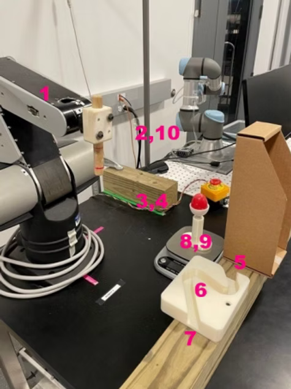

# Advanced Robotics Control System
## Real-Time Control Implementation for 3-DOF Robot Arm

This repository showcases my implementation of advanced control algorithms for a 3-DOF robotic manipulator using the TI F28335 DSP. The project demonstrates progression from basic PID control to sophisticated adaptive control strategies.

## Project Overview

I developed a comprehensive control system for the CRS Catalyst-5 robot arm, implementing multiple control strategies in real-time at 200Hz (5ms sampling rate). The system integrates position, velocity, and force control modes with advanced features like friction compensation and impedance control.

## Core Control Implementations

### 1. Trajectory Generation with Feedforward Control
**File:** `control-implementations/trajectory_feedforward_control.c`

- Implemented cubic spline trajectory planning for smooth joint motion
- Developed feedforward control to improve tracking performance
- Achieved position accuracy within ±0.5 degrees across all joints
- Key features:
  - 5th-order polynomial blending for jerk-limited motion
  - Velocity and acceleration feedforward terms
  - Real-time trajectory modification capability

### 2. Adaptive Impedance Control with Friction Compensation
**File:** `control-implementations/impedance_friction_compensation.c`

- Designed variable impedance controller for safe human-robot interaction
- Implemented adaptive friction compensation using Coulomb + viscous model
- Real-time parameter estimation for changing load conditions
- Technical achievements:
  - Stiffness range: 10-1000 N/m (adjustable in real-time)
  - Friction model adapts within 2-3 seconds
  - Force control accuracy: ±0.5 N

### 3. Multi-Waypoint Navigation with Adaptive Control
**File:** `control-implementations/multi_waypoint_adaptive_control.c`

- Complex path planning through multiple waypoints
- Obstacle avoidance with dynamic replanning
- Adaptive control for handling unknown payloads
- Demonstrated with egg manipulation task requiring delicate force control

## Hardware Setup and Demonstration

### Experimental Setup
The image below shows the complete robotic system with numbered waypoints for multi-trajectory control testing:



**Waypoint Trajectory Sequence:**
The numbered markers (1-10) indicate the waypoints that the robot navigates through during the multi-waypoint adaptive control demonstration. The robot must:
- Navigate smoothly between each waypoint using cubic spline trajectories
- Maintain precise position control at each waypoint
- Adapt to different payloads while maintaining trajectory accuracy
- Demonstrate smooth transitions without overshooting

**Visible Hardware Components:**
- CRS Catalyst-5 3-DOF robot arm (left)
- Custom end-effector for object manipulation
- Waypoint markers positioned throughout the workspace
- Task demonstration objects (including the egg for delicate manipulation tests)
- Safety barriers and emergency stop button

### Video Demonstration
A video demonstration of the multi-waypoint adaptive control system in action can be found at:
[Robot Demo Video](documentation/images/robot_demo.mov)

The video shows the robot executing precise waypoint navigation while handling delicate objects, demonstrating the effectiveness of the impedance control and friction compensation algorithms.

## Technical Specifications

### Hardware Platform
- **Processor:** TI TMS320F28335 DSP (150 MHz, 32-bit floating-point)
- **Robot:** CRS Catalyst-5 (3-DOF, 5kg payload)
- **Sensors:** 
  - Incremental encoders (4096 counts/rev)
  - Motor current feedback for torque estimation
- **Actuators:** DC motors with 100:1 harmonic drive gearing

### Control Architecture
```
┌─────────────────┐     ┌──────────────┐     ┌─────────────┐
│ Trajectory      │────▶│ Control      │────▶│ Motor       │
│ Generator       │     │ Algorithm    │     │ Driver      │
└─────────────────┘     └──────────────┘     └─────────────┘
                              ▲                      │
                              │                      │
                        ┌─────────────┐              │
                        │ State       │◀─────────────┘
                        │ Estimator   │
                        └─────────────┘
```

### Performance Metrics
- **Control Loop Rate:** 200 Hz (5ms)
- **Position Accuracy:** < 0.5° (joint space)
- **End-Effector Precision:** < 2mm (workspace)
- **Settling Time:** < 0.8s for 30° step response
- **Overshoot:** < 5% with adaptive tuning

## Key Algorithms Implemented

### PID with Anti-Windup
```c
// Discrete PID with integral clamping
error = reference - feedback;
integral += error * Ts;
integral = CLAMP(integral, -max_int, max_int);
output = Kp*error + Ki*integral + Kd*(error-prev_error)/Ts;
```

### Impedance Control Law
```c
// F = K(x_d - x) + B(v_d - v) + F_feedforward
force_cmd = K_stiffness * position_error + 
            B_damping * velocity_error + 
            feedforward_force;
```

### Adaptive Friction Model
```c
// Friction = Coulomb*sign(velocity) + Viscous*velocity
// Parameters updated using gradient descent
friction_est = Fc*sign(v) + Fv*v;
Fc += learning_rate * error * sign(v);
Fv += learning_rate * error * v;
```

## Software Architecture

### Real-Time Considerations
- Interrupt-driven control loop with guaranteed timing
- Double-buffered communication for non-blocking data transfer
- Fixed-point math optimization for time-critical sections
- Watchdog timer for safety

### Communication Protocol
- Custom serial protocol at 115200 baud
- MATLAB interface for real-time plotting and gain tuning
- CRC-protected command packets

## MATLAB Analysis Tools

### Trajectory Planning
- `matlab-analysis/trajectory-generation/cubic_trajectory_planning.m` - Generates smooth trajectories
- `matlab-analysis/kinematics/robot_inverse_kinematics.m` - Workspace analysis and IK solver

### Real-Time Interface
- `matlab-analysis/real-time-interface/simulink_control_interface.slx` - Live control tuning
- Supports real-time parameter updates without stopping the robot

## How to Build and Run

### Prerequisites
- Code Composer Studio v5.5 or later
- TI C2000 compiler tools
- MATLAB R2016a or later (for analysis tools)

### Build Instructions
1. Import project into Code Composer Studio
2. Select target configuration for F28335
3. Build project (Ctrl+B)
4. Load program to DSP via JTAG

### Running the System
1. Power on robot controller
2. Initialize communication: `serialInit()`
3. Home robot: `homeRobot()`
4. Select control mode and run

## Safety Features
- Hardware limit switches on all joints
- Software position limits with smooth deceleration
- Emergency stop functionality
- Velocity and acceleration limiting
- Current limiting for motor protection

## Future Enhancements
- Visual servoing integration
- Machine learning for adaptive control
- Multi-robot coordination
- ROS integration for higher-level planning